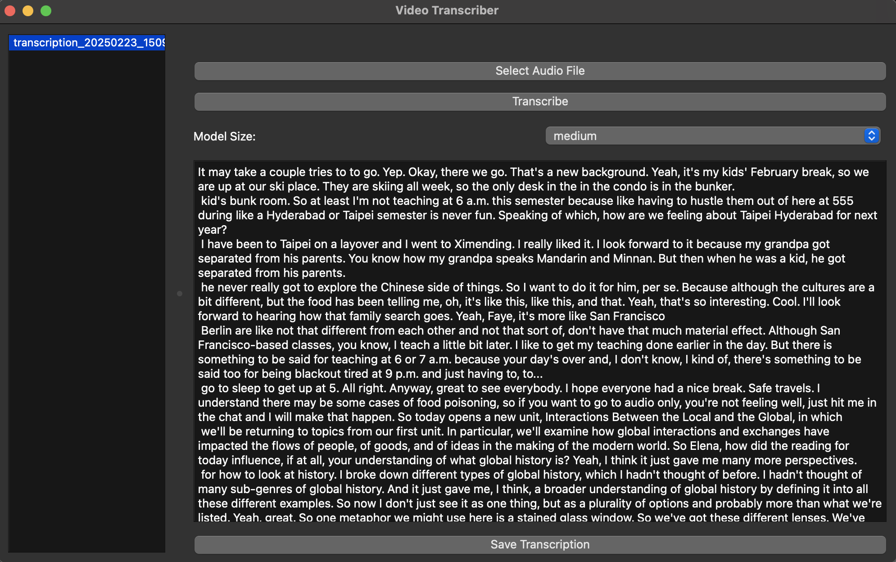

# Video Transcriber

A PyQt6-based desktop application for transcribing audio and video files using OpenAI's Whisper API.

Made by [Carl Kho](https://www.linkedin.com/in/carlkho/)


## Features

- 🎥 Support for multiple audio/video formats (mp3, mp4, mpeg, mpga, m4a, wav, webm)
- 🔄 Automatic video to audio conversion
- 📝 Chunked processing for large files
- 💾 Auto-save functionality
- 📚 Transcription history
- 📊 Detailed progress tracking
- 🚀 Background processing
- 🎨 Modern UI with loading animations (coming soon)

## Requirements

- Python 3.8+
- FFmpeg (for audio processing) - [Download FFmpeg](https://ffmpeg.org/download.html) and add it to your system's PATH
- OpenAI API key

## Installation

1. Clone the repository:
```bash
git clone <repository-url>
cd utils_25MNRV
```

2. Create and activate a virtual environment:
```bash
python -m venv venv
source venv/bin/activate  # On Windows: venv\Scripts\activate
                          # On Windows with Zsh: source venv/Scripts/activate
```

3. Install dependencies:
```bash
pip install -r requirements.txt
```

4. Create a `.env` file with your OpenAI API key:
```bash
OPENAI_API_KEY=your-api-key-here
```

## Setup Virtual Environment

To set up the virtual environment and install the required packages, run the following commands:

```sh
./setup_venv.sh  # On Windows PowerShell: .\setup_venv.sh
                 # On Windows with Zsh: source ./setup_venv.sh
```

## Usage

1. Run the application:
```bash
python video_transcriber.py
```

2. Click "Select Audio File" to choose an audio or video file
3. Click "Transcribe" to start the transcription process
4. The transcription will be automatically saved in the `transcriptions` directory
5. Use the sidebar to access previous transcriptions

## Features in Detail

### Audio Processing
- Automatic chunking of large files
- Progress tracking for each processing step
- Temporary file cleanup

### Transcription
- Uses OpenAI's Whisper API
- Support for different model sizes
- Detailed progress reporting

### UI Features
- Split-pane interface with transcription history
- Progress bars with percentage indicators
- Skeleton loading animations
- Error handling with user notifications

## Development

### Project Structure
```
utils_25MNRV/
├── video_transcriber.py  # Main application
├── requirements.txt      # Dependencies
├── .env                 # API key configuration
├── transcriptions/      # Saved transcriptions
└── temp/               # Temporary processing files
```

### Logging
- Detailed debug logging
- Progress tracking in terminal
- Error reporting

## Known Limitations

- Maximum file size: 25MB per chunk (OpenAI API limitation)
- Audio-only output for video files
- Internet connection required for transcription
